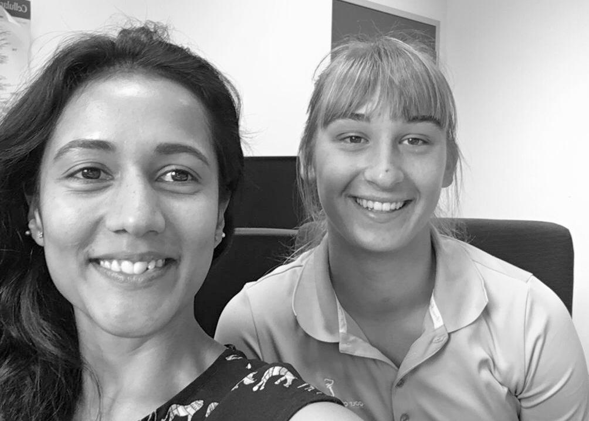

# My participation at the EMBL Women in Science Project

This project is designed for me to visit EMBL for a period of time and get to know the day-to-day life of the researchers working there on different projects.

*You check check all the stories [here](https://malvikasharan.github.io/EMBL-Women-2019/)*

